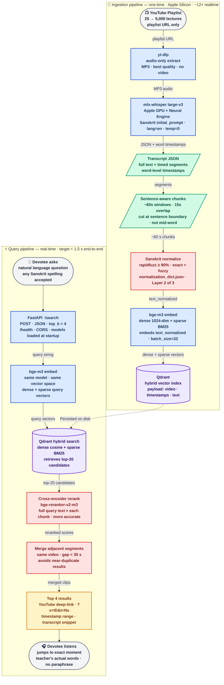

<div align="center">
  
</div>

# vāṇī-anusandhāna 🪷

> **वाणी-अनुसन्धान** — AI-powered semantic search and RAG engine for disciplined inquiry into sacred Vedic teachings and wisdom

[](https://www.gnu.org/licenses/agpl-3.0)
[](https://www.python.org/)
[](https://developer.apple.com/documentation/apple-silicon)
[](#design-philosophy)

Semantic search over a single spiritual teacher's YouTube lectures. Devotees ask a question in plain language and receive the exact moments in the teacher's videos where that topic is addressed — with timestamped deep-links, transcript snippets, and a direct jump into the recording. Every answer is the teacher's actual words, retrieved not generated. The system runs entirely on a MacBook Pro with Apple Silicon, costs near zero to operate, and is designed to scale from a 25-video pilot to a 5,000-video archive without changing architecture.

---

## What it does

**Question from a devotee:**
> *"What is the difference between śravaṇa and smaraṇa in bhakti practice?"*

**System returns 4 results:**

| # | Video | Timestamp | Snippet |
|---|-------|-----------|---------|
| 1 | Bhakti-yoga: The Path of Devotion | [14:32 → 15:48](https://www.youtube.com/watch?v=EXAMPLE1&t=872s) | *"...śravaṇa is the foundation — hearing the holy name, hearing the Bhāgavatam. Smaraṇa deepens what śravaṇa plants. Without hearing first, remembrance has nothing to hold..."* |
| 2 | The Nine Limbs of Bhakti | [08:17 → 09:40](https://www.youtube.com/watch?v=EXAMPLE2&t=497s) | *"...Prahlāda tells us: śravaṇaṁ kīrtanaṁ viṣṇoḥ smaraṇaṁ. Hearing comes first. Then kīrtana. Then smaraṇa. This order is not accidental — it is the ācārya's mercy..."* |
| 3 | Stages of Sādhana | [31:05 → 32:22](https://www.youtube.com/watch?v=EXAMPLE3&t=1865s) | *"...in the beginning, we can barely remember Kṛṣṇa for thirty seconds. That is fine. Śravaṇa builds the capacity. Smaraṇa is the fruit of sustained hearing..."* |
| 4 | Nārada-bhakti-sūtra Study | [52:44 → 53:59](https://www.youtube.com/watch?v=EXAMPLE4&t=3164s) | *"...one who hears constantly develops the faculty of continuous remembrance. This is why the guru says: hear first, for one year, two years. Smaraṇa will come..."* |

**No AI-generated answers. No paraphrasing. No hallucinations. The teacher's actual words are the answer.**

---

## Why this name

*Vāṇī* (वाणी) means the spoken word — and in the Gauḍīya Vaiṣṇava tradition, specifically the *transmitted speech* of the teacher: the living instruction that travels through the paramparā. When the teacher speaks, vāṇī flows. This system is built to make that vāṇī findable.

*Anusandhāna* (अनुसन्धान) does not simply mean "search" in the Google sense. It carries the sense of *sustained, contemplative inquiry* — following a thread carefully, with attention and reverence. A devotee doing *anusandhāna* of scripture is not skimming; they are listening for something specific, with an open heart.

Together: **vāṇī-anusandhāna** — *the careful inquiry through the teacher's transmitted speech*. The name signals to devotees that this project was built with the same care they bring to their own study.

---

## Architecture



**Color key** — 🔵 blue: compute steps &nbsp;·&nbsp; 🟣 purple: vector storage &nbsp;·&nbsp; 🔴 red: quality/Sanskrit layers &nbsp;·&nbsp; 🟢 green: data artifacts &nbsp;·&nbsp; 🟡 amber: output &nbsp;·&nbsp; ⚪ gray: devotee endpoints

### 🔄 Ingestion pipeline (one-time, ~12x realtime on Apple Silicon M5)

1. **yt-dlp** extracts audio-only MP3s from a YouTube playlist without downloading video.
2. **mlx-whisper large-v3** transcribes each lecture using Apple Silicon GPU + Neural Engine, with a carefully tuned Sanskrit `initial_prompt` that biases the model toward correct diacritical forms.
3. Transcripts are saved as **JSON with word-level timestamps** — the foundational asset, kept forever.
4. **Sentence-aware chunking** walks the transcript and cuts at natural sentence boundaries (not fixed time windows), producing ~60-second chunks with 15-second overlaps so no thought is split mid-sentence.
5. **Sanskrit normalization** applies a fuzzy-match dictionary (built during calibration) to correct terms the prompt missed — `rapidfuzz` at 90% similarity threshold.
6. **bge-m3** generates both dense (1024-dim) and sparse vectors from each normalized chunk. Both vectors are stored in **Qdrant** with the full chunk payload.

### ⚡ Query pipeline (real-time, <1.5 seconds end-to-end)

1. Devotee submits a natural-language question to the **FastAPI** `/search` endpoint.
2. **bge-m3** embeds the query into dense + sparse vectors (same model as ingestion — vectors live in the same space).
3. **Qdrant hybrid search** retrieves the top-20 candidate chunks, combining semantic similarity (dense) with keyword recall (sparse/BM25-like).
4. **bge-reranker-v2-m3** cross-encoder scores each candidate against the full query text — a more expensive but more accurate ranking pass.
5. **Adjacent-segment merging** collapses results from the same video that are less than 30 seconds apart, avoiding four nearly-identical clips.
6. **Top 4 results** are returned with YouTube deep-links (`?v=ID&t=Ns`), formatted timestamp ranges, and the normalized transcript snippet.
7. Devotee clicks, jumps directly to `t=754s` in the video, and hears the teacher's answer.

---

## Design philosophy

### 🎯 Retrieval only — no LLM-generated answers

This system does not use a language model to generate, summarize, or paraphrase answers. This is a deliberate architectural and theological choice:

- **Theological**: In the Vaiṣṇava tradition, the guru's words carry *śakti* — spiritual potency. A paraphrase, however accurate, is not the same as hearing the teacher directly. The system must not interpolate.
- **Trust**: Devotees can verify any result by clicking the timestamp. Nothing is invented.
- **Cost**: No inference API calls. Zero ongoing LLM cost.
- **Simplicity**: The retrieval pipeline is auditable, reproducible, and requires no prompt engineering to maintain.

Any future feature that generates or paraphrases answers is out of scope for this project.

### 🧘 Sanskrit-first transcription — the 3-layer approach

Sanskrit handling is the highest-leverage part of this system. See [`SANSKRIT_VOCAB_METHODOLOGY.md`](SANSKRIT_VOCAB_METHODOLOGY.md) for the full methodology. In brief:

- **Layer 1 — Whisper `initial_prompt`**: A natural-prose sentence using diacritical Sanskrit terms biases the model toward correct forms at transcription time. Capped at ~240 tokens, so terms are chosen carefully.
- **Layer 2 — Post-processing normalization dictionary**: A `rapidfuzz`-backed JSON dictionary catches errors the prompt missed. No size limit. Grows for the life of the project.
- **Layer 3 — Dual indexing**: Both `text_original` (what Whisper heard) and `text_normalized` (corrected) are stored. A devotee typing "bhagavatam" or "Bhāgavatam" hits the same chunks.

Target: >85% Sanskrit term accuracy after Layers 1 + 2.

### 💻 Local-first, then optionally cloud

Everything runs on a MacBook Pro with Apple Silicon: transcription, embedding, vector search, and serving. There is no cloud dependency. When ready for public access, a Cloudflare Tunnel exposes the local server, or the index is migrated to a small VPS. The architecture doesn't change — only where it runs.

### 🔄 Sentence-aware chunking, not fixed time windows

Fixed-window chunkers (every 30 seconds, every 60 seconds) produce chunks that cut mid-sentence. When a devotee clicks a deep-link and lands in the middle of a thought, the experience feels broken. This system accumulates transcript segments until the buffer is ~60 seconds long, then waits for the next sentence boundary before cutting. The result: every chunk is a complete thought. Every deep-link lands at the start of something coherent.

---

## Cost summary

| Item | This project | Typical cloud RAG |
|------|-------------|-------------------|
| Transcription (5,000 hrs audio) | $0 (local M5) or ~$200 (rented GPU) | ~$1,800 (OpenAI Whisper API) |
| Embeddings | $0 (bge-m3, local) | ~$50–200/month (OpenAI) |
| Vector database | $0 (Qdrant, self-hosted) | $50–200/month (managed) |
| LLM inference | $0 (retrieval-only, no LLM) | $100–500/month |
| Hosting | $0 (local) or $5–10/month (VPS) | $20–50/month |
| **Total one-time** | **$0–$200** | **$2,000+** |
| **Total monthly** | **$0–$10** | **$200–$950** |

The full system — pilot through public deployment — costs under $300 one-time and under $120/year. Designed to be affordable for any spiritual non-profit or individual devotee.

---

## Quick start

### Prerequisites

- MacBook with Apple Silicon (M1/M2/M3/M4/M5), 16+ GB RAM
- macOS 13+, [Homebrew](https://brew.sh), Python 3.11+
- [Docker Desktop](https://www.docker.com/products/docker-desktop/) (for Qdrant)

### Setup

```bash
git clone https://github.com/sunilpradhansharma/vani-anusandhana.git
cd vani-anusandhana
make setup              # installs deps, pulls Qdrant image, starts container
python verify_setup.py  # should print: ✅ environment ready
```

### Pilot run (25 videos)

```bash
# 1. Inventory the playlist (no download, ~30 seconds)
python scripts/01_inventory_playlist.py

# 2. Download audio for 3 calibration videos
python scripts/02_download_audio.py --limit 3

# 3. Baseline transcription (no Sanskrit prompt yet)
python scripts/03_transcribe.py --ids ID1,ID2,ID3 --output-suffix baseline

# 4. Read transcripts carefully; log Sanskrit errors
python scripts/04_log_sanskrit_errors.py --input data/transcripts/ID1.baseline.json

# 5. Build Sanskrit prompt from errors + seed terms
python scripts/05_build_sanskrit_prompt.py

# 6. Re-transcribe calibration videos with prompt; verify >70% error fix rate
python scripts/03_transcribe.py --ids ID1,ID2,ID3 --prompt-file config/sanskrit_prompt.txt --output-suffix tuned
python scripts/05b_diff_transcripts.py --baseline data/transcripts/ID1.baseline.json --tuned data/transcripts/ID1.tuned.json

# 7. Batch transcribe remaining 22 (~90 min on M5)
bash scripts/06_batch_transcribe.sh

# 8. Chunk → embed → index → serve → evaluate
python scripts/07_chunk_transcripts.py
python scripts/08_index_chunks.py
uvicorn app.main:app --port 8000
python scripts/10_run_evaluation.py
```

See [`PILOT_RUNBOOK.md`](PILOT_RUNBOOK.md) for the full stage-by-stage guide with quality checkpoints.

---

## Project structure

```
vani-anusandhana/
├── README.md                         ← this file
├── PILOT_RUNBOOK.md                  ← mental model, stages, checkpoints
├── CLAUDE_CODE_PROMPTS.md            ← prompts for Claude Code sessions
├── SANSKRIT_VOCAB_METHODOLOGY.md     ← 3-layer Sanskrit handling approach
├── architecture.md                   ← Mermaid diagram source
├── LICENSE                           ← AGPL-3.0
├── NOTICE.md                         ← copyright + intent statement
├── CONTRIBUTING.md                   ← how to contribute
├── CONTRIBUTORS.md                   ← contributor list
├── pyproject.toml                    ← project metadata + tool config
├── Makefile                          ← setup, qdrant-up/down, clean-audio
├── docker-compose.yml                ← Qdrant on port 6333
├── verify_setup.py                   ← smoke test: imports + Qdrant + bge-m3
│
├── config/
│   ├── sanskrit_seed_terms.txt       ← ← VERSION CONTROL, GROW OVER TIME
│   ├── sanskrit_prompt.txt           ← ← VERSION CONTROL, BACKUP
│   ├── normalization_dict.json       ← ← VERSION CONTROL, BACKUP
│   └── sanskrit_errors.md           ← living log of observed mis-transcriptions
│
├── data/
│   ├── playlist_inventory.json       ← video metadata from Stage 1
│   ├── playlist_inventory.txt        ← human-readable inventory
│   ├── audio/                        ← downloaded MP3s — DELETE AFTER TRANSCRIPTION
│   ├── transcripts/                  ← ← KEEP FOREVER, BACKUP SEPARATELY
│   └── chunks/                       ← chunked + normalized JSON (rebuildable)
│
├── scripts/
│   ├── 01_inventory_playlist.py
│   ├── 02_download_audio.py
│   ├── 03_transcribe.py
│   ├── 04_log_sanskrit_errors.py
│   ├── 05_build_sanskrit_prompt.py
│   ├── 05b_diff_transcripts.py
│   ├── 06_batch_transcribe.sh
│   ├── 06b_validate_transcripts.py
│   ├── 07_chunk_transcripts.py
│   ├── 08_index_chunks.py
│   ├── 10_run_evaluation.py
│   └── 10b_analyze_eval.py
│
├── app/
│   └── main.py                       ← FastAPI server: /search, /health, /
│
├── eval/
│   ├── sample_questions.md           ← 30 devotee questions for evaluation
│   ├── scoring_template.csv          ← fill in after running evaluation
│   └── raw_results.html              ← visual review of top-4 results
│
└── logs/                             ← transcription logs, batch logs
```

---

## Tech stack

| Layer | Choice | Why |
|-------|--------|-----|
| Audio download | yt-dlp (Python API) | No subprocess; handles age-restriction, rate limits, archive |
| Transcription | mlx-whisper large-v3 | Apple Silicon GPU + Neural Engine; ~12x realtime; free |
| Embedding | BAAI/bge-m3 (FlagEmbedding) | Dense + sparse from one model; multilingual; free; runs on MPS |
| Vector database | Qdrant (self-hosted Docker) | Native hybrid search; persistent; scales to 5,000 videos easily |
| Reranker | BAAI/bge-reranker-v2-m3 | Cross-encoder accuracy boost; runs locally; pairs with bge-m3 |
| API | FastAPI + uvicorn | Fast, typed, async; minimal overhead |
| Frontend | Vanilla HTML + HTMX | No build step, no framework, no npm; readable by anyone |
| Language | Plain Python (no LangChain) | LangChain adds abstraction without adding value for a retrieval-only pipeline |
| Fuzzy match | rapidfuzz | Sanskrit normalization; faster than fuzzywuzzy; well-maintained |

---

## Roadmap

- ✅ **Phase 1: Pilot** — 25-video proof of concept, evaluation harness, quality checkpoints
- 🚧 **Phase 2: Full transcription** — 5,000 videos (~17 days continuous on M5, or ~5 days on rented GPU); Sanskrit term list expansion
- 📋 **Phase 3: Public deployment** — Cloudflare Tunnel or small VPS ($5–10/month); domain; basic rate limiting
- 🔮 **Future possibilities**:
  - Speaker filtering (isolate teacher's voice from Q&A participants)
  - Verse-aware indexing (Bhāgavatam 1.2.6 as a structured searchable field)
  - Devotee correction workflow (flag mis-transcribed Sanskrit in the UI)
  - Multilingual UI (Hindi, Bengali, Tamil)
  - Mobile PWA for offline browsing of transcripts
  - Periodic re-indexing as new lectures are published

---

## Contributing

Contributions that serve the project's mission are warmly welcomed. See [`CONTRIBUTING.md`](CONTRIBUTING.md) for the full guide.

**Highest-priority ways to help:**
- **Sanskrit corrections** — if you spot a mis-transcribed term, open an issue using the Sanskrit Correction template. Include the wrong form, the correct form, and the video + timestamp.
- **Sample devotee questions** — real questions from real devotees improve the evaluation set and reveal gaps in coverage.
- **Performance improvements** — faster indexing, lower memory, better chunking heuristics.
- **Translations** — UI strings, documentation.
- **Documentation** — typo fixes, clarity improvements, corrections.

Features that would cause the system to generate or paraphrase answers are outside scope and will be respectfully declined.

---

## License

This project is licensed under the **GNU Affero General Public License v3.0** (AGPL-3.0). See [`LICENSE`](LICENSE) for the full text.

The AGPL was chosen deliberately: if you deploy a modified version of this system as a public service, you must release your modifications as open source. The teacher's words belong to the lineage. Improvements to how those words are searched should belong to the community too.

---

## Acknowledgments

- The teacher, whose lectures are the entire reason this project exists, and whose consistent, decades-long service made a 5,000-video corpus possible.
- The [MLX team at Apple](https://github.com/ml-explore/mlx) for making Apple Silicon a first-class ML platform.
- [BAAI](https://www.baai.ac.cn/) for bge-m3 and bge-reranker-v2-m3 — free, multilingual, locally runnable, and genuinely competitive.
- [OpenAI](https://openai.com/research/whisper) for open-sourcing Whisper.
- [Qdrant](https://qdrant.tech/) for a vector database that is both powerful and free to self-host.
- The devotees who test, ask questions, report errors, and make this system more accurate over time.

---

## Citation

For academic use:

```bibtex
@software{vani_anusandhana_2026,
  author    = {YOUR_USERNAME},
  title     = {v\={a}\d{n}\={i}-anusandh\={a}na: Semantic Search over Spiritual Teacher Lectures},
  year      = {2026},
  url       = {https://github.com/YOUR_USERNAME/vani-anusandhana},
  license   = {AGPL-3.0}
}
```

---

<div align="center">

🪷 **Hare Kṛṣṇa** 🪷

Built with care for devotional communities worldwide.

*वाणी-अनुसन्धान — the seeker's careful inquiry through the teacher's transmitted voice.*

</div>
