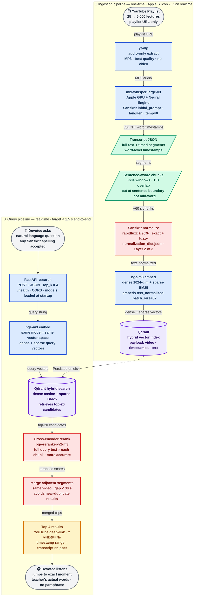

# vāṇī-anusandhāna — system architecture

**Color key** — blue: compute steps · purple: vector storage · red: quality/Sanskrit layers · green: data artifacts · amber: output · gray: devotee endpoints
