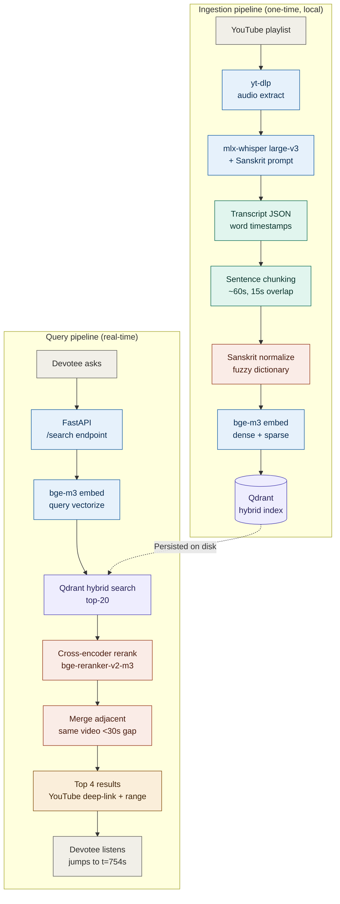

# vāṇī-anusandhāna — system architecture

```mermaid
graph TD

subgraph ING["Ingestion pipeline (one-time, local)"]
  YT[YouTube playlist] --> DL[yt-dlp<br/>audio extract]
  DL --> WH[mlx-whisper large-v3<br/>+ Sanskrit prompt]
  WH --> TR[Transcript JSON<br/>word timestamps]
  TR --> CH[Sentence chunking<br/>~60s, 15s overlap]
  CH --> SN[Sanskrit normalize<br/>fuzzy dictionary]
  SN --> EM[bge-m3 embed<br/>dense + sparse]
  EM --> QD[(Qdrant<br/>hybrid index)]
end

subgraph QRY["Query pipeline (real-time)"]
  DV[Devotee asks] --> API[FastAPI<br/>/search endpoint]
  API --> QE[bge-m3 embed<br/>query vectorize]
  QE --> QS[Qdrant hybrid search<br/>top-20]
  QS --> RR[Cross-encoder rerank<br/>bge-reranker-v2-m3]
  RR --> MG[Merge adjacent<br/>same video &lt;30s gap]
  MG --> R4[Top 4 results<br/>YouTube deep-link + range]
  R4 --> DV2[Devotee listens<br/>jumps to t=754s]
end

QD -.->|Persisted on disk| QS

classDef compute fill:#E6F1FB,stroke:#185FA5,color:#042C53
classDef storage fill:#EEEDFE,stroke:#534AB7,color:#26215C
classDef quality fill:#FAECE7,stroke:#993C1D,color:#4A1B0C
classDef data fill:#E1F5EE,stroke:#0F6E56,color:#04342C
classDef output fill:#FAEEDA,stroke:#854F0B,color:#412402
classDef devotee fill:#F1EFE8,stroke:#5F5E5A,color:#2C2C2A

class DL,WH,EM,API,QE compute
class QD,QS storage
class SN,RR,MG quality
class TR,CH data
class R4 output
class YT,DV,DV2 devotee
```
